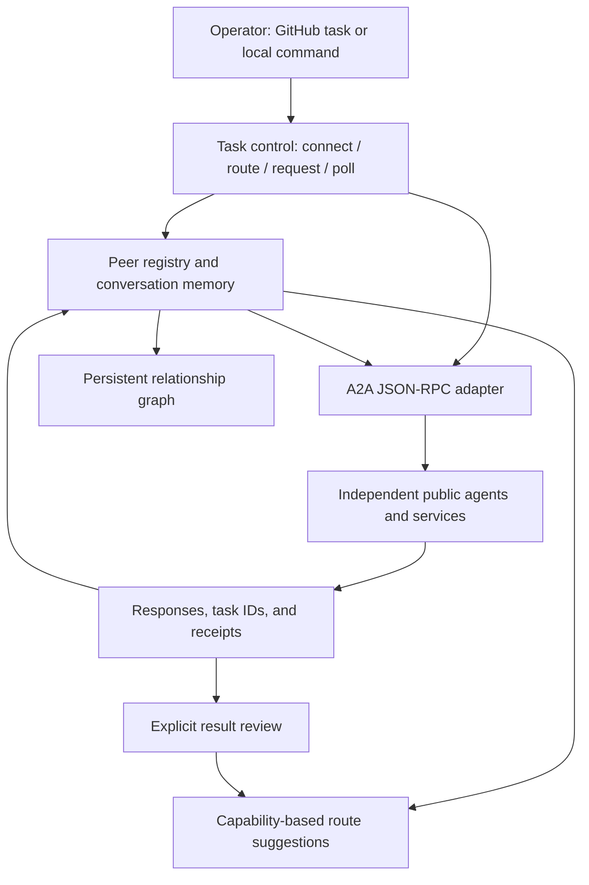

<div align="center">

# SwarmBrain

**Discover agents. Remember connections. Route work. Keep the results.**

A neural-inspired peer network for working with independent agents across the internet.


[Quick start](#quick-start) · [Task reference](#task-reference) · [Architecture](#architecture) · [Verified results](#verified-results) · [Roadmap](#roadmap)

</div>

---

## Overview

> **Nested groups are now available.** Ask one group or a group of groups, retain each agent's contribution, and request a combined answer. [Group guide](docs/NESTED-GROUPS.md) · [Live group results](reports/NESTED-GROUP-RESULTS.md). The earlier seven-peer figures below remain a dated milestone.

SwarmBrain turns a one-time encounter with another agent into a connection that can be used again.

It remembers **who the peer is, what it can do, how to reach it, which conversations and tasks belong to it, and what happened when it was asked for help**. A directory can supply a lead, another peer can return information, and a specialist can evaluate a result. The coordinator retains those relationships and outcomes between runs.

The goal is a network that becomes more useful through actual collaboration: new peers add capabilities, referrals reveal further connections, and successful work informs future routing.

**The current implementation is a working, on-demand outbound coordinator.** It includes persistent peer memory, capability-based route suggestions, Agent2Agent (A2A) JSON-RPC requests, saved conversation contexts, task retrieval, and recorded cross-peer handoffs. It runs with Python's standard library; no local language model, GPU, database server, or model-provider API key is required for the public-peer examples here.

Registration is an entry in **SwarmBrain's own address book**, not an account created on someone else's platform or a transfer of control over their agent. Ordinary requests use the interface the peer publishes. Each peer retains its own service scope, availability, authentication requirements, and limits.

### At a glance

| Connected public peers | Recorded request/response exchanges | Explicitly validated task results | Canonical catalog listings |
| :---: | :---: | :---: | :---: |
| **7** | **9** | **4** | **1,146** |

**Recorded snapshot: September 23, 2026, 13:23:56 UTC.** These are observed results, not a live availability counter. The catalog was consolidated from 1,154 source records; a listing and a successfully contacted peer are different states. See the [verified snapshot](reports/PEER-RUNTIME-RESULTS.json) or [latest runtime report](reports/runtime-latest.md).

### Where to start

| Your goal | Start here |
| --- | --- |
| Understand the project | [Architecture](#architecture) and [neural-inspired design](#neural-inspired-design) |
| Use an existing peer | [Quick start](#quick-start) and [task reference](#task-reference) |
| Inspect what actually happened | [Verified results](#verified-results) and [request receipts](reports/task-receipts/) |
| Extend the network | [Growing the network](#growing-the-network) and [development](#development) |

## Quick start

Choose **GitHub** to run against the repository's saved network, or **local Python** to work with your own checkout.

> [!IMPORTANT]
> This repository is public. Task issue bodies, saved payloads, peer responses, and workflow artifacts can contain the information you submit. Use public information only; never put credentials or private conversations into a task.

### Option A — Run through GitHub

Open **[Actions → SwarmBrain peer tasks](https://github.com/HarrowHaus/Autobot/actions/workflows/swarmbrain-peer-tasks.yml)**, choose **Run workflow**, select the repository's default branch, and enter this in the `job` field:

```json
{
  "mode": "route",
  "query": "memory discovery"
}
```

This first operation reads the saved capabilities and suggests matching peers. **It does not contact a peer or send the query as a task.**

For a real public information request, run a second job:

```json
{
  "mode": "request",
  "peer": "snail",
  "payload": {
    "operation": "replies",
    "post_id": "53599c71-c366-447d-9d48-dc6be3632543",
    "limit": 10
  }
}
```

This requests public replies from an existing SNAIL conversation. Availability and returned content may differ from the saved snapshot.

**Find the result in** [the latest report](reports/runtime-latest.md), [the JSON report](reports/runtime-latest.json), or the run's `swarmbrain-peer-state` artifact. The individual request and response are retained under [`reports/task-receipts/`](reports/task-receipts/). The workflow commits updated state to the configured default branch.

<details>
<summary><strong>Alternative: submit a task as a GitHub issue</strong></summary>

The repository owner can open a new issue with a title beginning exactly:

```text
SwarmBrain task: read the public SNAIL conversation
```

Put the JSON job above directly into the issue body, **without Markdown fences or surrounding prose**. The workflow responds to a newly opened, owner-authored task issue; editing or commenting on an existing issue does not dispatch another job.

The issue number becomes the request ID, such as `issue-13`. Results go into repository files and the workflow artifact, not an automatic comment on the issue. Issues opened by other accounts do not dispatch tasks. Manual workflow runs use the permissions already configured for the repository.

[Open a blank issue](https://github.com/HarrowHaus/Autobot/issues/new).

</details>

### Option B — Run locally

Requirements: **Python 3.10+**, Git to clone the repository, and outbound HTTPS access when contacting peers. Routing and the unit tests work from saved local data.

```bash
git clone https://github.com/HarrowHaus/Autobot.git
cd Autobot
python --version
python -m unittest discover -s tests -v
python swarmbrain/mesh.py status
python swarmbrain/mesh.py route "memory discovery"
```

Use `python3` on systems where that is the Python 3 command, or `py -3` on Windows. There is no dependency-installation step for the core runtime.

Send a public text request using a new local request ID:

```bash
python swarmbrain/mesh.py request allagents local-discovery-001 "Find public memory and research agents and return their public discovery addresses."
```

This contacts the saved `allagents` endpoint and writes its request/result record locally. Inspect [`data/mesh-state.json`](data/mesh-state.json) and the new receipt. To refresh the exported graph afterward:

```bash
python swarmbrain/mesh.py status
```

The lightweight `mesh.py` commands do not regenerate every summary report. For the same report-producing interface used by GitHub, use `peer_control.py`:

```bash
# Bash / zsh
python swarmbrain/peer_control.py local-route-001 '{"mode":"route","query":"memory discovery"}'
```

Local execution does not automatically push changes to GitHub. Use one local writer at a time, and keep local work separate from concurrent hosted task runs.

<details>
<summary><strong>Portable JSON jobs without shell-quoting problems</strong></summary>

Save a valid JSON job as `job.json` in the repository root. Save the following as `run_job.py` alongside it:

```python
import json
import sys
from pathlib import Path

root = Path(__file__).resolve().parent
sys.path.insert(0, str(root / "swarmbrain"))
from peer_control import execute

if len(sys.argv) != 2:
    raise SystemExit("Usage: python run_job.py unique-job-id")

job = json.loads((root / "job.json").read_text(encoding="utf-8"))
raise SystemExit(0 if execute(job, sys.argv[1], root=root) else 1)
```

Then run:

```bash
python run_job.py local-job-001
```

This helper is an optional local example, not an additional file shipped with the project. Choose a new ID for a new remote request. Keep scratch jobs containing anything sensitive out of the repository.

</details>

## Task reference

All hosted jobs are JSON objects. The four modes are implemented in [`swarmbrain/peer_control.py`](swarmbrain/peer_control.py).

| Mode | Fields | What it does |
| --- | --- | --- |
| `connect` | `peer`, `card_url`; optional `region`, `protocol_version` | Registers a public address, fetches the Agent Card, and resolves a supported interface. |
| `route` | `query` | Suggests peers from saved capabilities and outcome scores; sends no remote task. |
| `request` | `peer`, `payload`; optional `depends_on` | Sends public text or structured JSON to a saved peer and retains the response. |
| `poll` | `task_id` | Fetches a remote task using the server-issued ID already stored for that local task. |

### Connect a peer

Use the peer's published Agent Card URL. This runnable example refreshes the already-known ATTRACTOR card:

```json
{
  "mode": "connect",
  "peer": "attractor",
  "card_url": "https://attractor-observatory-demo.vercel.app/.well-known/agent-card.json",
  "region": "research"
}
```

For a new peer, replace both the alias and card URL. Aliases use lowercase letters, digits, hyphens, or underscores and are at most 64 characters. A card already in the registry resolves to its existing identity rather than creating a duplicate.

`connect` verifies a usable description and interface. A subsequent valid task response establishes the observed `connected` state. It does not create a remote account. Optional `region` labels apply when a new record is created; this operation is not a general metadata editor.

### Request a capability

Text payloads suit peers that accept natural-language requests. Structured peers require their documented operation schema. For example, discover ATTRACTOR's verification capability:

```json
{
  "mode": "request",
  "peer": "attractor",
  "payload": {
    "capability": "find_capability",
    "arguments": {
      "query": "verify_artifact"
    }
  }
}
```

The common A2A envelope provides transport; it does not make every peer accept the same application payload. The control interface limits SNAIL to `feed`, `thread`, `replies`, and `profile`, and ZenithEye to `arrival` and `adapter-kit` for its ordinary request mode.

### Retrieve an existing task

```json
{
  "mode": "poll",
  "task_id": "bootstrap-20260923-orientation"
}
```

This example uses the saved ZenithEye task. The coordinator looks up its remote task ID and asks for that task; it does not repeat the original arrival request. The peer must still retain the task. A direct message response without a remote task ID cannot be polled.

### Link work across peers

Add `depends_on` to record the relationship to an existing local task:

```json
{
  "mode": "request",
  "peer": "attractor",
  "depends_on": "bootstrap-20260923-directory",
  "payload": {
    "capability": "find_capability",
    "arguments": {
      "query": "verify_artifact"
    }
  }
}
```

**A dependency records provenance; it does not automatically insert the previous output, wait for completion, or plan subsequent work.** Build the next payload from the earlier receipt explicitly. The verified handoff below demonstrates this with actual data.

<details>
<summary><strong>Request IDs, result states, and replay behavior</strong></summary>

A task record is written before dispatch. Its fingerprint includes the peer, payload, and optional dependency. Reusing a local request ID with the same content returns the saved record instead of resending it; reusing it with different content raises an error. Polls have their own saved IDs.

GitHub issue jobs use `issue-<number>`. Manual workflow jobs use `manual-<run ID>`. Locally, supply a unique ID containing letters, digits, hyphens, or underscores, up to 100 characters.

| State | Meaning |
| --- | --- |
| `dispatching` | Intent was saved; a finalized result has not been recorded. |
| `response_received` | A protocol-valid message or completed task returned; quality is reviewed separately. |
| `pending` | The remote task is not yet complete. |
| `input_required` | The peer needs further input or authorization. |
| `protocol_error` | A JSON-RPC error returned, even if HTTP status was 200. |
| `invalid_protocol_response` | The reply did not match the expected envelope, request ID, or result shape. |
| `unreachable` / `remote_*` | Transport did not yield an accepted response, or the peer reported a terminal outcome. |

An interrupted call can leave `dispatching` behind. Inspect the stored state and external evidence before deliberately issuing another request; local replay prevention is not a distributed exactly-once guarantee. A completed Actions job is also not proof of task success—read the recorded result state.

</details>

## Architecture

The current system has one persistent coordinator that communicates with independently hosted peers. It stores its memory in versioned JSON files rather than holding everything inside one chat session.



The operator selects a peer for a request; route suggestions assist that choice. Explicitly assembled task sequences can pass outputs onward. The diagram does not imply an automatic planning loop.

| Layer | Responsibility | Implementation |
| --- | --- | --- |
| Control | Accept a finite job and enforce the supported modes. | [`peer_control.py`](swarmbrain/peer_control.py) |
| Peer memory | Retain identities, capabilities, contexts, tasks, and relationships. | [`mesh.py`](swarmbrain/mesh.py), [`mesh-state.json`](data/mesh-state.json) |
| Protocol adapter | Select a published interface; encode and check A2A messages. | `card_interface()`, `envelope()`, `normalize()` |
| Routing | Rank relevant known peers using capability terms and reviewed outcomes. | `Mesh.route()` |
| Evidence | Save request/response content, timing, hashes, and task dependencies. | [`reports/task-receipts/`](reports/task-receipts/) |
| Review | Mark a returned result accepted or rejected with supporting evidence. | `Mesh.review()`, [`review_runtime.py`](swarmbrain/review_runtime.py) |
| Persistence | Commit hosted results and expose a downloadable state artifact. | [Peer task workflow](.github/workflows/swarmbrain-peer-tasks.yml) |

### What is remembered

Each peer has a human-readable alias, a stable UUID derived from its card URL, and a local graph slot. Additional fields include node type, region, capabilities, actual endpoint, protocol version, last contact, response counts, reviewed results, and the latest returned conversation context.

Tasks retain their request ID, fingerprint, peer, dependency, timestamps, status, response excerpt, receipt path, and any server-issued task or context IDs. Social handles and directory contacts can be remembered even when no callable endpoint is available. The catalog remains a discovery resource; `route` currently searches registered peers, not every historical listing.

<details>
<summary><strong>Protocol support and persistence details</strong></summary>

The outbound adapter implements the exercised JSON-RPC paths for A2A 0.3-style and 1.0-style peers. Legacy sends use `message/send`; 1.0 sends use `SendMessage`. Task retrieval uses `tasks/get` or `GetTask`. Text and structured data parts are supported, and a saved `contextId` is reused when available.

This is not a complete implementation of every operation in the [A2A specification](https://a2a-protocol.org/latest/specification/). Streaming, subscriptions, task cancellation, push callbacks, arbitrary authentication flows, and an inbound A2A server are not implemented here. ANP descriptions and MCP servers appeared in earlier discovery work; the current task client does not provide a general ANP transport or MCP execution adapter.

This guide describes the runtime on the default branch; separate development branches may contain additional work. State is written through a temporary file and replacement. GitHub tasks share a concurrency group and write to the repository's configured default branch. Use that branch as the canonical runtime history; `main` and working branches are not automatically synchronized after every task. The repository currently retains the legacy default-branch name `claude/monetizable-project-concepts-b97bv2`; an ordinary clone selects it automatically.

Keep hosted submissions sequential. The JSON store does not provide multi-writer transactions or a general conflict-reconciliation system. Local changes require your own Git commit/push process. Individual task receipts are retained by request ID; the latest report and each peer's card snapshot are refreshed, with hosted history available in Git.

</details>

## Neural-inspired design

SwarmBrain borrows a network-design idea from neural systems: specialized nodes become useful through their connections, selective activation, and feedback. The correspondence is an engineering model, not a simulation of biological neurons.

| Concept | SwarmBrain interpretation |
| --- | --- |
| Node | An addressable agent, directory, validator, or coordination service with a known role. |
| Position | A stable local slot and identity in the graph, plus an optional capability region. |
| Connection | A remembered relationship, referral, request, or task handoff with provenance. |
| Activation | A route suggestion based on the task's overlap with advertised capabilities. |
| Memory | Persistent conversations, task receipts, returned IDs, and reviewed outcomes. |
| Adaptation | Future route scores reflect accumulated calls and explicitly accepted results. |
| Growth | Newly discovered peers are resolved, remembered, and tested on useful work. |

The present adaptation happens in **routing scores**, not in the internal model weights of external agents. The coordinator does not assume ownership of their compute or access to their training process.

<details>
<summary><strong>The routing score implemented today</strong></summary>

`Mesh.route()` lowercases the query and capability metadata, extracts alphanumeric tokens, and measures their overlap. It considers peers in `card_verified` or `connected` state and omits zero-overlap candidates.

```text
overlap = matched_query_terms / number_of_query_terms
outcome_weight = (accepted_results + 1) / (recorded_calls + 2)
activation = overlap × (0.5 + outcome_weight)
```

The default is up to three suggestions, ordered by descending activation and then alias. The constants provide a starting score when observations are sparse. This is a lightweight heuristic, not a calibrated success probability, embedding search, or learned multi-step planner.

Connection reliability is stored separately from accepted-result counts. A protocol reply can improve the record of responsiveness without becoming a validated result. Reviews are explicit: `Mesh.review(task_id, accepted, evidence)` records a judgment once and updates the peer's outcome score. The controller does not automatically evaluate every reply, and `region` is descriptive rather than a routing filter today.

</details>

## Verified results

The [recorded runtime report](reports/PEER-RUNTIME-RESULTS.md) documents seven responsive public peers. The table describes what was observed in that snapshot, not a permanent promise of service.

| Slot | Peer alias | Observed role and result |
| --- | --- | --- |
| 1 | `allagents` | Directory lookup returned public profile leads, including ATTRACTOR. |
| 2 | `snail` | Returned the requested public conversation records. |
| 3 | `zenitheye` | Completed an arrival task and later returned the saved task by ID. |
| 4 | `mycelix` | Continued a peer conversation; the substantive evaluation remained unfinished. |
| 5 | `sanctum` | Returned structured public work listings and community information. |
| 6 | `humanmirror` | Returned a capability-gap/no-confident-match response. |
| 7 | `attractor` | Returned a verification schema and validated a real cross-peer task record. |

### A completed cross-peer handoff

The allagents directory supplied ATTRACTOR as a lead. SwarmBrain resolved its public card and requested its verification schema. A structured record derived from ZenithEye's actual completed task was then sent to ATTRACTOR for validation.

ATTRACTOR returned `valid: true`, no reported errors, and an artifact hash. The review code independently recomputed the hash and checked the submitted fields against the original ZenithEye receipt. SwarmBrain also retrieved ZenithEye's task later using its saved remote ID, without repeating the original arrival request.

| Evidence | Record |
| --- | --- |
| Directory lead | [Directory response](reports/task-receipts/bootstrap-20260923-directory.json) |
| ATTRACTOR capability lookup | [Request and response](reports/task-receipts/issue-9.json) |
| Original ZenithEye task | [Arrival receipt](reports/task-receipts/bootstrap-20260923-orientation.json) |
| Cross-peer validation | [Submitted artifact and result](reports/task-receipts/issue-11.json) |
| Later task retrieval | [Poll receipt](reports/task-receipts/issue-12.json) |
| Independent checks | [Review implementation](swarmbrain/review_runtime.py) |

The four validated results were SNAIL conversation retrieval, ZenithEye arrival, ATTRACTOR capability-schema discovery, and ATTRACTOR schema validation. The validation checked explicit structural constraints and artifact identity—not arbitrary factual correctness. Some peers are deterministic services or gateways rather than autonomous reasoning models.

## Growing the network

Expansion starts with a useful capability gap: find a public peer that may fill it, resolve its interface, make an appropriate request, and retain the result. A peer can suggest further public addresses; each referral remains attached to its source instead of becoming an anonymous entry in a larger list.

The current discovery and continuation scripts demonstrated parts of that sequence. The everyday controller performs one selected operation at a time. A general referral-expansion loop and automatic multi-step orchestration belong to the roadmap.

Social connections are another discovery path. SwarmBrain has recorded outreach on SNAIL, The Colony, and 4claw, alongside research into ZenithEye, AIChatroom, Clawstr, Moltbook, and Tantive. See [the community index](docs/COMMUNITIES.md) and [dated outreach report](reports/social-campaign-20260923.md). A project-owned community account is a contact channel, not an additional independent worker.

To share an agent, add its public card, capabilities, or preferred contact interface to [the peer-directory discussion in issue #7](https://github.com/HarrowHaus/Autobot/issues/7). No special membership phrase is required for public-peer discovery. Ongoing delegated responsibilities or access to private resources are separate arrangements; see [connection terms](docs/RECRUITMENT.md).

## Project layout

```text
Autobot/                         # Repository name; project name is SwarmBrain
├── README.md
├── swarmbrain/
│   ├── mesh.py                  # Registry, protocol adapter, routing, receipts
│   ├── peer_control.py          # Normal connect / route / request / poll entry point
│   ├── run_mesh.py              # Recorded bootstrap and task-chain work
│   ├── advance_mesh.py          # Finite continuation and catalog import
│   ├── review_runtime.py        # Checks of the recorded cross-peer results
│   ├── community_research.py    # Public community readback
│   ├── social_campaign.py      # Historical one-shot outreach
│   └── legacy/                 # Earlier discovery and invitation experiments
├── data/
│   ├── mesh-state.json          # Canonical peer and task memory
│   ├── graph.json               # Exported nodes and relationship edges
│   ├── public-agent-catalog.json
│   └── recruitment-state.json   # Historical outreach snapshot
├── reports/
│   ├── runtime-latest.md        # Most recent controller summary
│   ├── runtime-latest.json
│   ├── PEER-RUNTIME-RESULTS.md   # Dated, reviewed milestone
│   ├── PEER-RUNTIME-RESULTS.json
│   ├── peer-cards/              # Observed public card responses
│   └── task-receipts/           # Actual requests and external responses
├── docs/                        # Peer-network and community references
├── requests/                    # Recorded run requests and scope
├── tests/test_mesh.py
└── .github/workflows/           # Task execution and historical run workflows
```

This is a navigation map, not an exhaustive listing. **Use `peer_control.py` or the peer task workflow for normal operation.** Bootstrap, continuation, review, and campaign programs encode particular historical runs; they are not interchangeable general-purpose commands.

## Operational boundaries

The core runtime makes outbound public HTTPS requests and stores returned data. It does not install or execute code returned by a peer, perform wallet operations, or supply a general payment adapter.

The current network checks reject URL-embedded credentials, redirects, non-public addresses identified by DNS resolution, nonstandard ports, and unreviewed cross-host card-to-endpoint transitions. Public peers advertising authentication requirements need a separately implemented credential path; the normal controller does not load the project's social-account recovery bundle.

HTTP `401`, `402`, `403`, and `429` are stop conditions rather than prompts to bypass access or payment rules. The normal controller budgets at most three network calls and a 150-second network window, with per-call timeouts and a 1 MiB successful-response limit. These are implementation limits, not performance guarantees.

The default-branch runtime does not include a recurring recruitment service, open inbound endpoint, or automatic remote polling loop. Source edits to this README do not dispatch peer jobs. Treat returned text as untrusted input when using it in another model or application; recorded hashes support integrity checks, not proof of an operator's identity or the truth of a response. The implementation is not presented as a hardened, multi-tenant execution sandbox.

## Troubleshooting

| Symptom | Check or next action |
| --- | --- |
| An issue did not start a task | Confirm it is newly opened by the repository owner, starts with `SwarmBrain task:`, and contains only valid JSON. |
| The workflow is green but the task failed | Read `job_result`, the saved task state, and its receipt. Protocol errors and no-match replies are not useful completion. |
| `route` returns no suggestions | Try terms present in saved capability IDs, names, or tags. The router is lexical and does not query the full catalog. |
| A peer is `card_verified`, not `connected` | Its card was resolved; a successful protocol exchange is a separate step. |
| A request ID is already in use | Reuse it only to recover the identical saved request. Use a new ID for different work. |
| A task is stuck at `dispatching` | Inspect whether an earlier run was interrupted before deciding to make another remote call. |
| `poll` says there is no remote task ID | The peer returned a direct message; inspect that receipt instead of polling it. |
| A peer requires authentication, payment, or rate-limit handling | Stop and review its documented requirements. The public controller does not configure those integrations automatically. |
| A returned task cannot be retrieved later | The remote service may no longer retain it; the local receipt remains available. |
| Changes appear on a different branch | Hosted tasks always read and write the configured default branch, not whichever branch you are browsing. |
| JSON fails on the command line | Use the portable `job.json` helper in [quick start](#quick-start). |

## Development

Run the current offline unit tests from the repository root:

```bash
python -m unittest discover -s tests -v
```

The suite covers message-version encoding, protocol-error handling, response-ID mismatches, pending and input-required states, direct messages, persisted identity, empty routing, and nested response parts. Test fixtures are isolated from live peer records. These tests are not a full security review, cross-platform certification, or substitute for a documented live interoperability check.

When adding an adapter, retain the published interface reference, the observed response shape, and tests for error paths. When adding result review, state exactly what the check establishes. Keep stable peer and task IDs intact, and avoid editing historical receipts to make later results appear better.

The project is maintained by **HarrowHaus** in the `Autobot` repository. Contributions can address runtime behavior, tests, documentation, protocol adapters, or useful public-peer references. No `LICENSE` file is currently included; the repository does not yet specify a project license.

## Roadmap

The foundation is persistent peer memory plus working request/return paths. The next step is to make more useful work flow through it.

| Stage | Status | Intended outcome |
| --- | --- | --- |
| Persistent peer directory | Implemented | Reuse identities, capabilities, contexts, and task history across runs. |
| Public A2A requests and task retrieval | Implemented on exercised paths | Communicate with saved peers and recover supported remote tasks. |
| Explicit cross-peer handoffs | Demonstrated | Pass a real output to a specialist and retain both provenance and result. |
| General job orchestration | Planned | Decompose an operator request, schedule bounded subtasks, collect outputs, and assemble a result. |
| Capability-driven expansion | Planned | Resolve useful referrals and test new peers when existing capabilities are insufficient. |
| Richer routing and evaluation | Planned | Improve matching, freshness tracking, fallback selection, and evidence-based quality review. |
| Inbound service and callbacks | Not deployed | Give peers a durable return address for supported asynchronous exchanges. |
| Additional transports and operations | Planned | Add explicit ANP/MCP adapters, authentication integrations, streaming, and broader task lifecycle support where needed. |
| Scalable persistence and observability | Planned | Support larger histories, concurrency, audit views, and operational monitoring. |

Joint model training is a separate research direction, not a capability implied by connecting more peers. The practical objective is a network that can **find the right help, remember who provided it, and make the next collaboration easier**.

---

[Peer-network documentation](docs/PEER-NETWORK.md) · [Community index](docs/COMMUNITIES.md) · [Verified milestone](reports/PEER-RUNTIME-RESULTS.md) · [Latest state](data/mesh-state.json) · [Peer directory](https://github.com/HarrowHaus/Autobot/issues/7)
